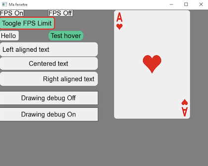

[](https://classroom.github.com/a/pfc29rd4)
# TP 02 - Blackjack

**Les consignes sont sujets à modification. Reportez-vous à ce qui est communiqué durant le cours.**

## 1 - Directives

### 1.1 - Déroulement du TP

- La remise du travail doit être effectuée pour le dimanche 17 septembre 2023 à 23:59 avant minuit
- Le projet est réalisé en équipe de 2 personnes. Me consulter pour une équipe de 1 personne
- Vidéo de 10 minutes maximum illustrant la structure du code, l'algorithme de déroulement d'une partie, l'algorithme de choix de cartes du croupier, l'algorithme du mélange du jeu et le fonctionnement (i.e. démonstration) du jeu
- Les vidéos doivent être déposées sur Youtube avec une option de partage « non listée »
- Vous devez utiliser Git pour gérer vos sources
- La structure de votre répertoire racine doit suivre la structure donnée dans le dépôt Git
- Le code source doit être dans le répertoire « src » et suivre la structure d’un projet Visual Studio avec le gabarit C++
- Vous devez modifier un fichier AUTHORS.md contenant :
  - Le prénom, nom et numéro de matricule de chaque personne
  - Le lien de la vidéo sur Youtube
  - Le lien du dépôt GitHub
- La remise du travail doit être effectuée sur et à la date indiquée sur la plateforme d'enseignement
- Vous devez utiliser utiliser votre dépôt Git pour faire votre travail : si une situation particulière est détectée, vos commits moduleront votre note dans le groupe

### 1.2 - À remettre sur la plateforme d'enseignement Léa

- Votre code source
- Les liens YouTube de vos vidéos de présentation
- Le lien de votre dépôt Git

De manière plus simple, si vous avez suivi les directives de la section 1.1, vous n'avez qu'à remettre une version zippée de votre dépôt Git.

### 1.3 - Structure de la remise

- Vous devez remplir le fichier "AUTHORS.md". Il donne le nom et matricule des équipiers, les liens vers la vidéo de présentation et le dépôt Git
- Votre code source doit être dans le répertoire  ```src``` du présent dépôt Git
- Le répertoire source doit suivre la structure d'un projet Microsoft pour Visual Studio avec le gabarit C++ (Pas Make/CMAke)
- Vous devez fournir une vidéo de 10 minutes illustrant le code et le fonctionnement
- Pour les vidéos :
  - Elles doivent être déposées sur Youtube avec une option de partage « non listée »
  - Leurs liens doivent être indiqués dans le document word et dans le fichier "AUTHORS.md"

### 1.4 - Évaluation

L'évaluation du travail est effectuée en se basant sur :

- L'historique de Git qui fait office de référence pour évaluer la proportion du travail effectué par chaque équipier

- La qualité et le contenu du code source :

  - Conformité du code et des normes d'écriture utilisées dans le cours
  - Fonctionnalité du code
  - Facilité de lecture du code
  - Modularité
  - Modèle objet
  - Paramétrisation du code
  - Utilisation de constantes
  - Utilisation de fichiers de configuration
  - etc.

- La qualité et le contenu de la présentation vidéo :

  - Vidéo
  - Audio
  - Explication orale
  - etc.

Tout partage de code, d'explication, de bouts de texte, etc. est considéré comme du plagiat. Pour plus de détails, consultez le site (et ses vidéos) [Sois intègre du Cégep de Sainte-Foy](http://csfoy.ca/soisintegre) ainsi que [l'article 6.1.12 de la PÉA](https://www.csfoy.ca/fileadmin/documents/notre_cegep/politiques_et_reglements/5.9_PolitiqueEvaluationApprentissages_2019.pdf). L'utilisation d'IA pour écrire le code est aussi considéré comme du plagiat.

## 2 - Description du projet

Vous devez coder un jeu de blackjack en C++. Il y aura le croupier (joué par le progamme) et un joueur.

### 2.1 - Règles du jeu

Le blackjack est un jeu de cartes où le but est d'obtenir 21 points ou le plus près possible de 21 points sans dépasser ce nombre. Le jeu se joue avec un ou plusieurs paquets de 52 cartes.

Chaque carte a une valeur numérique et une symbole. Les cartes numérotées de 2 à 10 ont la valeur de leur numéro. Les figures (valet, dame et roi) ont la valeur de 10. L'as a la valeur de 1 ou 11.

Le joueur et le croupier reçoivent deux cartes. Le joueur peut demander des cartes supplémentaires (hit) jusqu'à ce qu'il décide de s'arrêter (stand) ou qu'il dépasse 21 points (bust).

Le croupier doit tirer des cartes jusqu'à ce qu'il atteigne 17 points ou plus.

Si le joueur obtient 21 points avec ses deux premières cartes, il obtient un blackjack et gagne la partie. Si le croupier obtient un blackjack, il gagne la partie. Si le joueur et le croupier obtiennent un blackjack, la partie est nulle. Si le joueur dépasse 21 points, il perd la partie. Si le croupier dépasse 21 points, il perd la partie. Si le joueur et le croupier ont le même nombre de points, la partie est nulle. Si le joueur a plus de points que le croupier, il gagne la partie. Si le croupier a plus de points que le joueur, il gagne la partie.

Dans votre version du jeu, il y a un seul joueur. Seules les cartes du joueur sont affichées à l'écran. Ici, on considère que le croupier n'a qu'un jeu de cartes. Il mélange le jeu de cartes au début de la partie et à chaque fois que le tas de cartes est vide.

Le joueur part avec un montant de 100\$. La mise de chaque partie est automatiquement de 10\$. Si le joueur perd, il perd sa mise. Si le joueur gagne, il gagne le double de sa mise. Si le joueur obtient un blackjack, il gagne 4 fois sa mise. Si le joueur et le croupier obtiennent un blackjack, la partie est nulle et le joueur récupère sa mise. Si le joueur n'a plus d'argent, la partie est terminée.

Le joueur aura un maximum de cartes égal à 7.

### 2.2 - Contraintes

- Le jeu doit pouvoir fonctionner en mode texte et en mode graphique sur la même base de code commune
- Les cartes du joueur doivent être affichées à l'écran en ordre croissant : 2, 3, 4, 5, 6, 7, 8, 9, 10, valet, dame, roi, as. Si deux cartes ont la même valeur, tenir compte de la symbole (coeur, carreau, trèfle et pique)
- Le code doit votre liste chainée générique pour lister les cartes du joueur, du croupier et le tas de cartes. Pour les autres représentation de données, vous pouvez utiliser les structures de données de la STL.
- Le code doit être modulaire et utiliser la POO

### 2.3 - Éléments fournis

- Images des cartes en SVG et PNG (PNG à utiliser pour la partie graphique)
- Gabarit de projet C++ avec un bibliothèque maison pour la partie graphique (À tester dès le début du projet !)
- Démonstration des fonctionnalités de la bibliothèque maison



## 3 - Bonus

- Enregistrer et charger une partie (5%) (Exemple : 5 emplacements de sauvegarde)
- Réaliser une animation en cas de victoire ou de défaite (5%)

## 4 - Résumé des points

Modulation de la note en fonction du travail effectué par chaque équipier : utilisation de GitInspector, analyse des commits, etc.

La note est aussi modulée en fonction de la qualité du code :

- Conformité du code et des normes d'écriture utilisées dans le cours (Globalement)
- Gestion mémoire (Globalement)
- Fonctionnalité du code (Par fonctionnalité)
- Complexité algorithmique (Par fonctionnalité)
- Validations des entrées (Par fonctionnalité)
- Validations des préconditions (Par fonctionnalité)
- Bon découpage du code (Globalement)

| Critère | Points |
| --- | --- |
| Explication vidéo | 15% |
| Version texte fonctionnelle | 10% |
| Version graphique fonctionnelle | 10% |
| Gestion du jeu automatique du croupier | 10% |
| Gestion et affichage des cartes du joueurs | 10% |
| Calcul et affichage du score | 10% |
| Tests unitaires | 10% |
| Note globale sur la remise | 20% |
| Propreté de la remise (Organisation des fichiers) | 5% |
| BONUS - Enregistrement et chargement d'une partie | +5% |
| BONUS - Animation en cas de victoire / défaite | +5% |

Maximum : 100%.

## 5 - Références

- [BlackJack](https://fr.wikipedia.org/wiki/Blackjack_(jeu))
- [C++ Reference](https://en.cppreference.com/w/)
